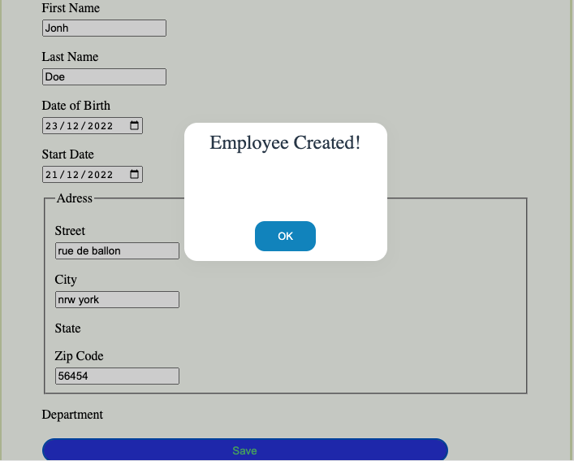

[](https://forthebadge.com) [](https://forthebadge.com) [](https://forthebadge.com)

# simple-component-libraryA library of React components created using `create-react-app`.

MrballerpopUp is a modal library popup to confirm a form, configurable & accessible to display modals for your application.

#### EXAMPLE



## Installation Run the following command:

```
npm i mrballerpopup
```

You'll

## Authors

- [@Brandon JR](https://github.com/Mrballer59)
